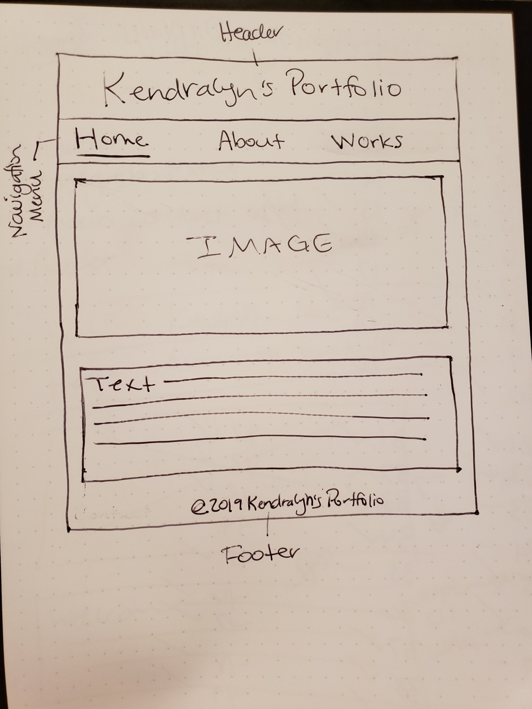
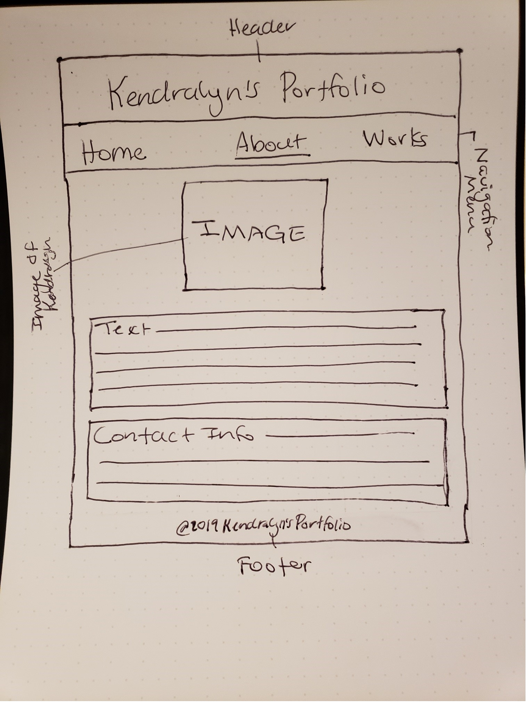
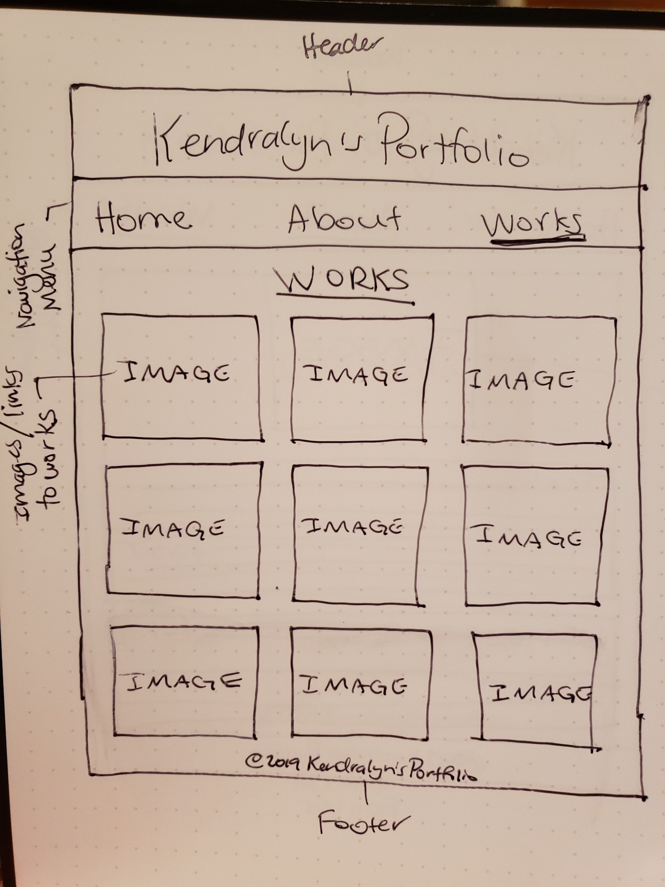

# My INF 7420 Project

I am going to build a portfolio website for my INF 7420 project. The main purpose of this project will be to showcase my school assignments and help me find a job after graduation. 

## Wireframes

Here are some wireframes that show the layout of how the site will be constructed.

Home page:

Header - will include name of the site and the navigation menu.

Navigation Menu - will include links to pages within site.

Main Content - will provide an explanation of the site and what the site offers.

Footer - will contain copywrite information.

About page:

Header - will include name of the site and the navigation menu.

Navigation Menu - will include links to pages within the site.

Main Content - will include information about the site's author and contact information.

Footer - will contain copyright information.

Works page:

Header - will include name of the site and the navigation menu.

Navigation Menu - will include links to pages within the site.

Main Content - will provide images and links of works.

Footer - will include copyright information.